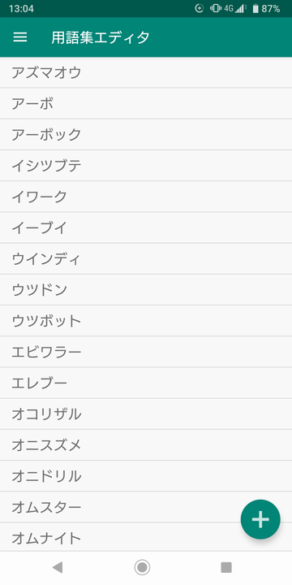
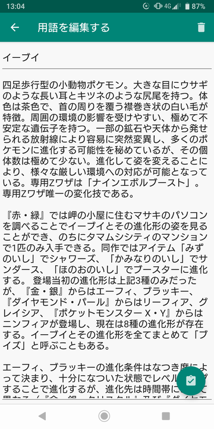
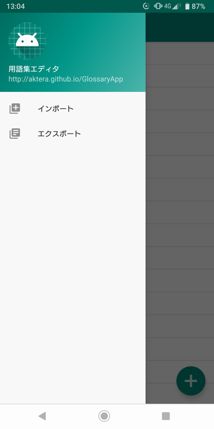

# 用語集エディタ

## 概要

- 用語集を編集・閲覧するためのAndroidアプリです。
- データのインポート・エクスポートを行うことができます。

## 動作環境

- Android 5 (Android API Level 21) 以上。

## インストール

- githubのreleasesのページからダウンロードできます。パッケージファイル (GlossaryApp.apk) のリンクをタップすると、インストールパッケージがダウンロードされ、Androidにインストールしていいか確認を行います。
- アンインストールはAndroidアプリの標準的なアンインストール操作と同じです。
- Google Playに登録していない野良アプリです。自己責任でお願いします。

## 使い方

### 用語一覧画面

- 右下の ＋ アイコンをタップすると用語の新規登録が行えます。

### 用語入力画面

- タイトルと説明を入力し、右下の登録アイコンをタップすると、用語が登録されます。
- 右上のゴミ箱アイコンをタップすると、登録済みの用語を削除できます。

### アプリメニュー

- 用語一覧画面の左上のメニューアイコンをタップするとメニューが開かれ、データのインポート・エクスポートを行えます。
- ストレージ領域にエクスポートするため、「ストレージ」のアプリ権限を取得して良いか確認を行います。
- エクスポートされたファイルは、ストレージ領域の /Download/GlossaryApp.txt に保存されます。

## バージョン履歴

- 2019/01/17 GlossaryApp v1.00 リリース

## 著作権

- GlossaryAppの全ての配布物は「zlib/libpngライセンス」を適用します。
- (C) 2019 aktera.
